# Decision Tree - Sistem Pakar Rekomendasi Laptop

Diagram ini menggambarkan alur pengambilan keputusan berdasarkan `kebutuhan` dan `budget` dalam aplikasi sistem pakar.

```mermaid
flowchart TB
    A[Kebutuhan]
    A --> B1[Pelajar / Mahasiswa Umum]
    A --> B2[Profesional / Bisnis]
    A --> B3[Gaming]
    A --> B4[Desain Grafis / Konten Kreator]
    A --> B5[Pengembang / Programmer]

    B1 --> B1_1[Ekonomis]
    B1 --> B1_2[Menengah]
    B1 --> B1_3[Tinggi]
    B1 --> B1_4[Premium]

    B2 --> B2_1[Ekonomis]
    B2 --> B2_2[Menengah]
    B2 --> B2_3[Tinggi]
    B2 --> B2_4[Premium]

    B3 --> B3_1[Ekonomis]
    B3 --> B3_2[Menengah]
    B3 --> B3_3[Tinggi]
    B3 --> B3_4[Premium]

    B4 --> B4_1[Ekonomis]
    B4 --> B4_2[Menengah]
    B4 --> B4_3[Tinggi]
    B4 --> B4_4[Premium]

    B5 --> B5_1[Ekonomis]
    B5 --> B5_2[Menengah]
    B5 --> B5_3[Tinggi]
    B5 --> B5_4[Premium]

    B1_1 --> L11[RAM ≥ 4GB\nGPU: Integrated\nStorage ≥ 128GB]
    B1_2 --> L12[RAM ≥ 8GB\nGPU: Integrated\nStorage ≥ 256GB]
    B1_3 --> L13[RAM ≥ 16GB\nGPU: Integrated\nStorage ≥ 512GB]
    B1_4 --> L14[RAM ≥ 16GB\nGPU: any\nStorage ≥ 512GB]

    B2_1 --> L21[RAM ≥ 8GB\nGPU: Integrated\nStorage ≥ 256GB]
    B2_2 --> L22[RAM ≥ 16GB\nGPU: Integrated\nStorage ≥ 512GB]
    B2_3 --> L23[RAM ≥ 16GB\nGPU: Integrated\nStorage ≥ 512GB]
    B2_4 --> L24[RAM ≥ 32GB\nGPU: Integrated\nStorage ≥ 512GB]

    B3_1 --> L31[RAM ≥ 8GB\nGPU: dedicated\nStorage ≥ 512GB]
    B3_2 --> L32[RAM ≥ 16GB\nGPU: dedicated\nStorage ≥ 512GB]
    B3_3 --> L33[RAM ≥ 16GB\nGPU: dedicated\nStorage ≥ 512GB]
    B3_4 --> L34[RAM ≥ 16GB\nGPU: dedicated\nStorage ≥1024GB]

    B4_1 --> L41[RAM ≥ 8GB\nGPU: Integrated\nStorage ≥ 256GB]
    B4_2 --> L42[RAM ≥ 16GB\nGPU: any\nStorage ≥ 512GB]
    B4_3 --> L43[RAM ≥ 16GB\nGPU: dedicated\nStorage ≥ 512GB]
    B4_4 --> L44[RAM ≥ 32GB\nGPU: dedicated\nStorage ≥1024GB]

    B5_1 --> L51[RAM ≥ 8GB\nGPU: Integrated\nStorage ≥ 256GB]
    B5_2 --> L52[RAM ≥ 16GB\nGPU: Integrated\nStorage ≥ 512GB]
    B5_3 --> L53[RAM ≥ 16GB\nGPU: Integrated\nStorage ≥ 512GB]
    B5_4 --> L54[RAM ≥ 32GB\nGPU: any\nStorage ≥ 512GB]
```

## Penjelasan

- Level pertama: `kebutuhan` pengguna
- Level kedua: kategori `budget`
- Level ketiga: rule akhir berisi syarat minimum RAM, GPU, dan Storage

File ini dapat dibuka dengan preview Markdown yang mendukung Mermaid di VS Code.
